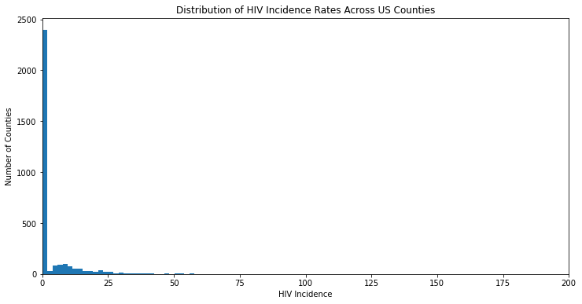
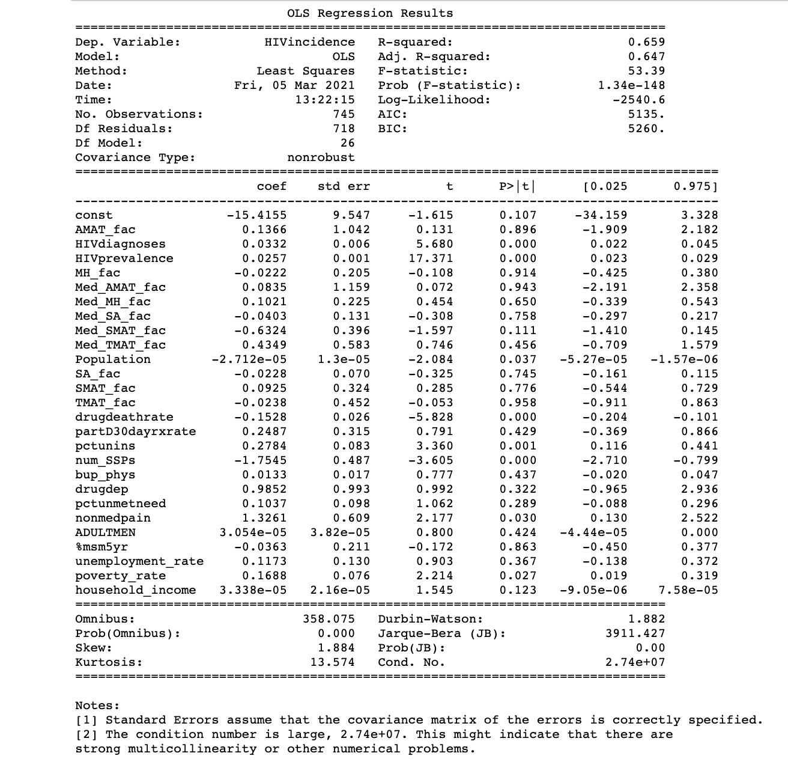
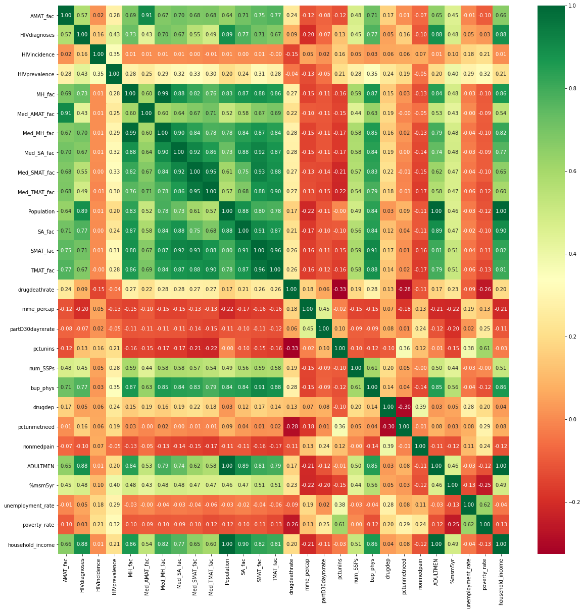
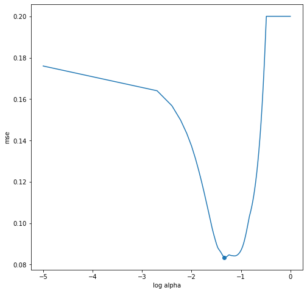
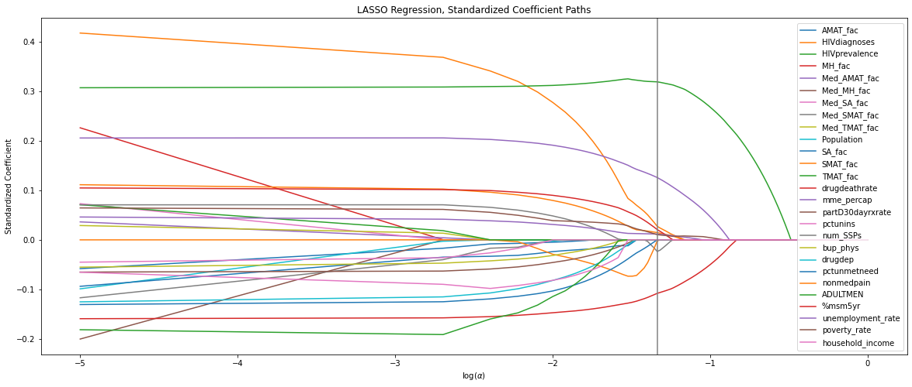

# HIV Prevalence Forecast

## Goals of the project

 - Create a predictive model that could be used to forecast the incidence of HIV cases with linear regression.
 - Using inferential regression, determine what features have the biggest impact on HIV.

## The dataset 

  The dataset includes features ranging from HIV specific information, like prevalence of cases, to proximity to medical facilities, opioid statistics, sexual preference information, and economic data. After exploring the data, a few things became clear to us:
  
   #### - Pre-emptively dealing with multi-collinearity 
   
   Without any prior domain knowledge, we could identify some features that were just functions/minor transformations of other columns, like prevalence and PLHIV, or drug deaths and rate of drug deaths. So we first dropped any columns that had redundant information. 
   
   #### - The skewed distribution of our target data
   
   Take a look at the distribution of HIV incidence values:
   
   
   
   There is a very clear skew in our distribution. The vast majority of counties have an incidence rate of 0. This imbalance in our target values is going to have an large influence on our linear regression. So, if we want to find the coefficients that can accurately predict HIV incidence, we'll need to filter out these zero values. Ideally, we'd create a logarithmic regression model to first do Classification to determine whether a county is zero or non-zero HIV incidence, and then feed the non-zero data into our linear regression model. For now, let's focus on our linear regression for non-zero counties.

   #### Using an OLS first
   
   
   
   #### - Using a LASSO Regression
   
   We chose a LASSO Regression because we had a large number of features.
   
   
   
   
   
   A lot of interesting data here, but it's going to make our data sparse. We'd like to use LASSO Regression to start eliminating some of these features so we can focus on those most relevant to our predictions. 
   
   So we split our data into hold-out and test data, then made sure to standardize our data. We then did a train-test split on our test data so we could iterate through various alpha values and find the alpha value that minimized our mean squared error:
   
   

  We found that our optimized alpha value was at roughly .0461. This gives us the best balance between predictive power and model complexity. Here's another visualization that shows how the coefficients changed as we adjust our alpha values:

   
   
 ### Conclusions

So, what are the largest positive coefficients?
 
  - HIV prevalence (.319)
  - Morphine Milligram Equivalent (.125)
  - MSM% 5 year (.02)
  - poverty rate (.01)
  - unemployment (.01)
  - Non-medical use of pain relievers

What are some negative coefficients?

 - Drug death rate (-.10)
 - Number of substance abuse treatment facilities (-.023)

  
Our Mean Squared Error on our final hold out data: .169
